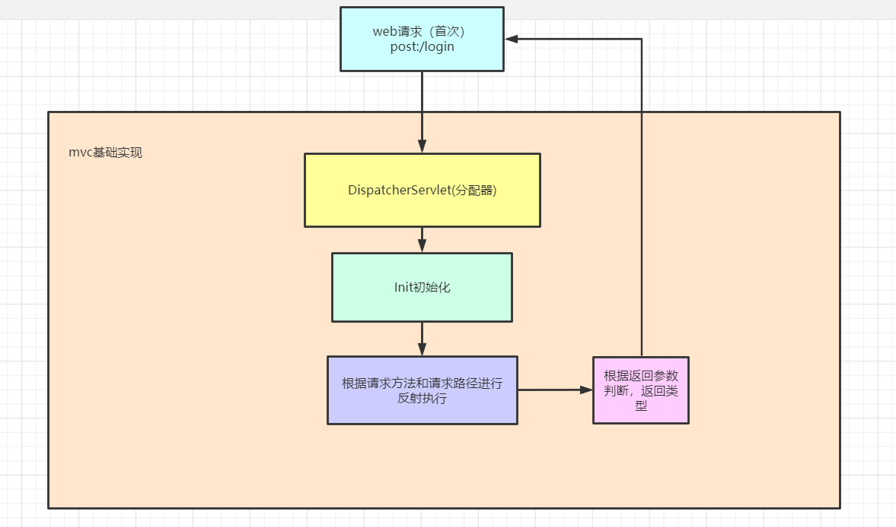

# clear-framework
## 简单的JavaWeb框架

### 一、Web请求




##### @Controller注解

标注在controller类的头部，表示这是一个控制器

##### @Autowired

标注在参数上面，向自动注入

##### @RequestMap

标注在方法上，表示请求的方法和参数

类型为

```
@RequestMap("get:/customerList")
```

##### view参数

表示返回一个视图，可设置传入参数

##### Data参数

表示返回一个Json数据

##### 完整例子如下

```java
import com.clear.chapter3.model.Customer;
import com.clear.chapter3.service.CustomerService;
import org.clear.framework.annotation.Autowired;
import org.clear.framework.annotation.Controller;
import org.clear.framework.annotation.RequestMap;
import org.clear.framework.bean.Param;
import org.clear.framework.bean.View;

import javax.servlet.ServletException;
import javax.servlet.annotation.WebServlet;
import javax.servlet.http.HttpServlet;
import javax.servlet.http.HttpServletRequest;
import javax.servlet.http.HttpServletResponse;
import java.io.IOException;
import java.util.HashMap;
import java.util.List;
import java.util.Map;

/**
 * @author clear
 * @since 2017-06-29.
 */
@Controller
public class CustomerController  {

    @Autowired
    private CustomerService customerService;

    @RequestMap("get:/customerList")
    protected Object doGet() throws ServletException, IOException {
        List<Customer> customerList = customerService.getCustomerList();
        View view = new View();
        view.setPath("customer.jsp");
        Map<String,Object> map = new HashMap<String,Object>(16);
        map.put("customerList", customerList);
        view.setModel(map);
        return view;
    }
     @RequestMap("put:/customer_edit")
    public Data editSubmit(Param param) {
        long id = param.getLong("id");
        Map<String, Object> fieldMap = param.getParamMap();
        boolean result = customerService.updateCustomer(id, fieldMap);
        Customer customer = customerService.getCustomer(id);
        return new Data(customer);
    }
}

```

